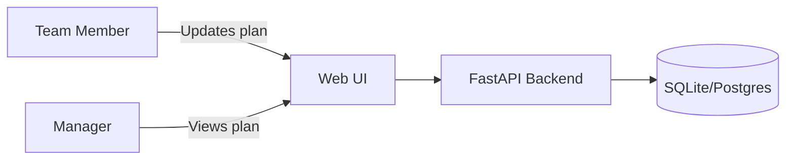
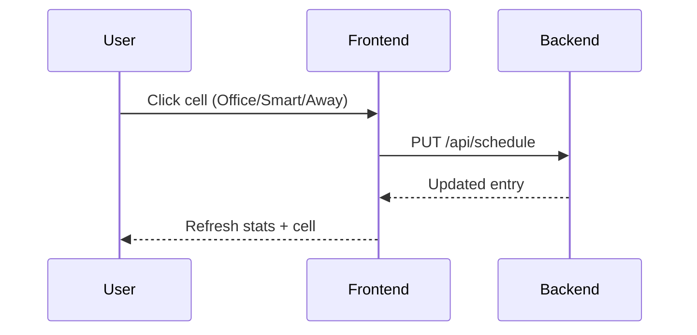

# TeamPlanner Documentation

## Introduction
TeamPlanner is a lightweight planning tool for teams of 5-10 members. It provides a shared calendar to mark smart-working days (S) and days off (A) without approvals, giving managers visibility into office availability.

## Vision and scope
- Offer a simple, low-friction workflow for marking smart-working and days off.
- Ensure managers can see who is expected in the office.
- Support local development, Docker, and cloud deployments via environment-based configuration.



## Frontend
- **Users page**: lists team members (id, name, email) and provides a + button to add new members.
- **Planning page**: shows a two-week calendar (current + next week) with interactive cells.
  - Empty/white cell: user in the office.
  - Blue cell with “S”: smart-working.
  - Green cell with “A”: day off.
- **Weekly attendance stats**: summary cards for office, smart-working, and away days.



## Backend
- **FastAPI** provides REST endpoints for users and schedules.
- **SQLModel + SQLite** store team members and non-office schedule entries.
- **Environment-based configuration** via `.env` and `DATABASE_URL`.

### Core endpoints
- `GET /api/users`
- `POST /api/users`
- `GET /api/schedule?start=YYYY-MM-DD&end=YYYY-MM-DD`
- `PUT /api/schedule`

## Configuration, installation and setup

### Prerequisites
- Python 3.11+
- [uv](https://github.com/astral-sh/uv) for dependency management (preferred)
- Docker + Docker Compose (optional, for containerized run)

### Local setup
```bash
uv venv
source .venv/bin/activate
uv pip install -r requirements.txt
```

### Environment
Create a `.env` file based on `.env.example`:
```bash
cp .env.example .env
```

Key variables:
- `DATABASE_URL` (default: `sqlite:///./teamplanner.db`)
- `ENVIRONMENT` (`local` enables auto-reload)

### Run the app
```bash
uvicorn app.main:app --reload --host 0.0.0.0 --port 8000
```

Navigate to:
- `http://localhost:8000/static/index.html` (Users)
- `http://localhost:8000/static/planning.html` (Planning)

### Docker setup (app + database)
The repository includes a `docker-compose.yml` that starts:
- `app` (FastAPI + static frontend)
- `db` (Postgres)

Run:
```bash
docker compose up --build
```

Navigate to:
- `http://localhost:8000/static/index.html` (Users)
- `http://localhost:8000/static/planning.html` (Planning)

## Limitations
- The current implementation uses SQLite by default; use a managed database for multi-instance production deployments.
- No authentication is included; add identity controls for broader use.

## Notes
- Only non-office days are stored in the database to keep schedules lean.
- The planning view always shows the current and next week for quick visibility.
