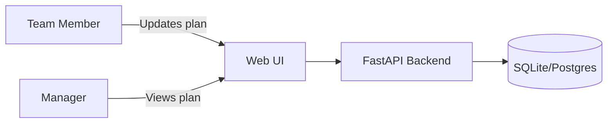
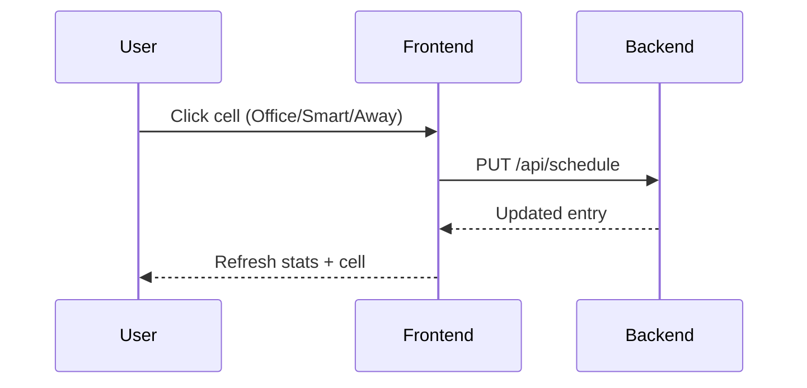

# TeamPlanner Documentation

## Introduction
TeamPlanner is a lightweight planning tool for teams of 5-10 members. It provides a shared calendar to mark smart-working days (S) and days off (A) without approvals, giving managers visibility into office availability.

## Vision and scope
- Offer a simple, low-friction workflow for marking smart-working and days off.
- Ensure managers can see who is expected in the office.
- Support local development, Docker, and cloud deployments via environment-based configuration.



## Frontend
- **Users page**: lists team members (id, name, email) and provides a + button to add new members.
- **Planning page**: shows a two-week calendar (current + next week) with interactive cells.
  - Empty/white cell: user in the office.
  - Blue cell with “S”: smart-working.
  - Green cell with “A”: day off.
- **Weekly attendance stats**: summary cards for office, smart-working, and away days.



## Backend
- **FastAPI** provides REST endpoints for users and schedules.
- **SQLModel + SQLite** store team members and non-office schedule entries.
- **Environment-based configuration** via `.env` and `DATABASE_URL`.

### Database schema
TeamPlanner persists data in two tables (names are the SQLModel defaults derived from the class names).

#### `user`
- **Columns**
  - `id` (integer, primary key, auto-increment)
  - `name` (string, required)
  - `email` (string, required)
- **Notes**
  - Stores the roster of team members.

#### `scheduleentry`
- **Columns**
  - `id` (integer, primary key, auto-increment)
  - `user_id` (integer, required, foreign key → `user.id`, indexed)
  - `day` (date, required, indexed)
  - `status` (string enum: `office`, `smart`, `away`)
- **Constraints & indexes**
  - Unique constraint on (`user_id`, `day`) to prevent multiple entries for the same user/day.
  - Indexes on `user_id` and `day` to speed up calendar range queries.
- **Relationships**
  - Many schedule entries belong to one user (one-to-many).

#### Storage behavior
- Only non-office days are stored to keep the schedule lean; missing rows imply `office`.
- SQLite is the default local store, while Docker uses Postgres via `DATABASE_URL`.

### Core endpoints
- `GET /api/users`
- `POST /api/users`
- `GET /api/schedule?start=YYYY-MM-DD&end=YYYY-MM-DD`
- `PUT /api/schedule`

## Configuration, installation and setup

### Prerequisites
- Python 3.11+
- [uv](https://github.com/astral-sh/uv) for dependency management (preferred)
- Docker + Docker Compose (optional, for containerized run)

### Dependencies
Runtime dependencies (pinned in `requirements.txt` and `pyproject.toml`):
- FastAPI, Uvicorn
- SQLModel, Pydantic Settings
- `psycopg2-binary` (Postgres driver for Docker usage)

Optional development dependencies (from `pyproject.toml` extras):
- pytest, httpx
- black, isort, mypy, pylint

No API keys are required.

### Local setup
```bash
uv venv
source .venv/bin/activate
uv pip install -r requirements.txt
```

### Local testing
Tests are run with `pytest` and live under `tests/`. They use an in-memory SQLite database, so you don't need Docker/Postgres to run them.

If you haven't created a virtual environment yet, run:
```bash
uv venv
```

Activate the environment:
- macOS/Linux:
  ```bash
  source .venv/bin/activate
  ```
- Windows (PowerShell):
  ```powershell
  .\.venv\Scripts\Activate.ps1
  ```

Install runtime + test dependencies:
```bash
uv pip install -r requirements.txt
uv pip install "pytest==8.1.1" "httpx==0.27.0"
```

Run the full test suite from the repository root:
```bash
pytest
```

Common variants:
```bash
pytest tests/test_api.py
pytest -k user_lifecycle
```

### Environment
Create a `.env` file based on `.env.example`:
```bash
cp .env.example .env
```

Key variables:
- `DATABASE_URL` (default: `sqlite:///./teamplanner.db`)
- `ENVIRONMENT` (`local` enables auto-reload)

### Run the app
```bash
uvicorn app.main:app --reload --host 0.0.0.0 --port 8000
```

Navigate to:
- `http://localhost:8000/static/index.html` (Users)
- `http://localhost:8000/static/planning.html` (Planning)

### Docker setup (app + database)
The repository includes a `docker-compose.yml` that starts:
- `app` (FastAPI + static frontend)
- `db` (Postgres)

Run:
```bash
docker compose up --build
```

Navigate to:
- `http://localhost:8000/static/index.html` (Users)
- `http://localhost:8000/static/planning.html` (Planning)

## Limitations
- The current implementation uses SQLite by default; use a managed database for multi-instance production deployments.
- No authentication is included; add identity controls for broader use.

## Notes
- Only non-office days are stored in the database to keep schedules lean.
- The planning view always shows the current and next week for quick visibility.
